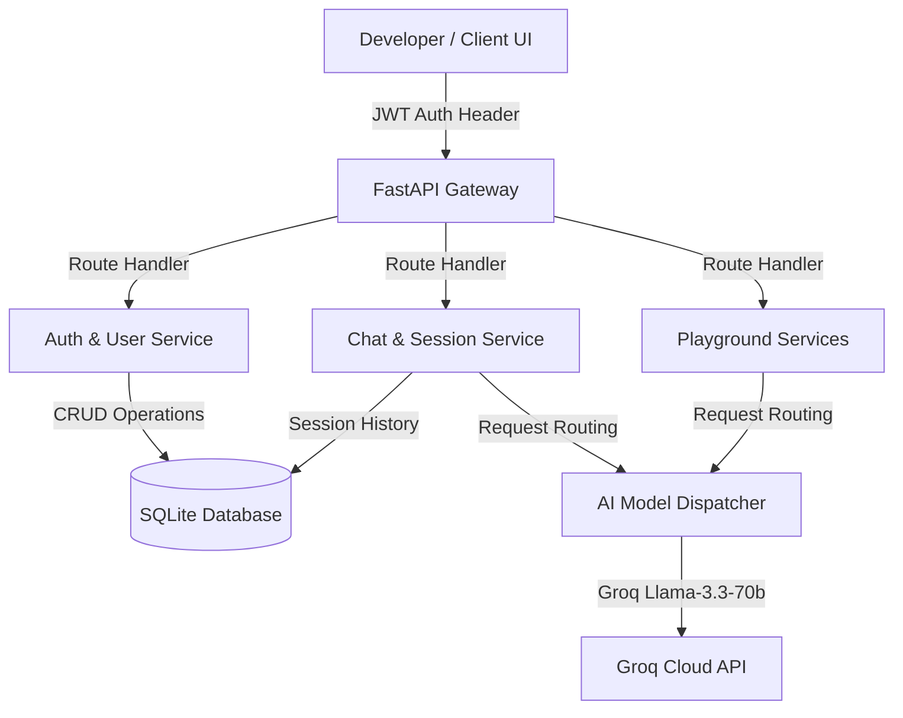

# ⚡ AI Code Generation Agent

> **🚀 Live Demo:** [https://code-agent-lugd.onrender.com](https://code-agent-lugd.onrender.com)

A production-ready, full-stack AI coding assistant platform. Inspired by next-generation AI IDE workspaces like Cursor and ChatGPT, this platform features a React + Vite frontend, a secure FastAPI backend, and an intelligent AI layer powered by **Groq (Llama-3.3-70b)** for sub-second code generation, debugging, explaining, and optimizing.

---

## 🌐 Live Deployment

| Environment | URL |
|---|---|
| **Production (Render)** | [https://code-agent-lugd.onrender.com](https://code-agent-lugd.onrender.com) |
| **API Health Check** | [https://code-agent-lugd.onrender.com/health](https://code-agent-lugd.onrender.com/health) |
| **API Docs (Swagger)** | [https://code-agent-lugd.onrender.com/docs](https://code-agent-lugd.onrender.com/docs) |

---

## 🏗️ System Workflow

The architecture is built for real-time interactivity, session state persistence, and low-latency AI responses.



### End-to-End Flow
1. **User Request**: The developer interacts with the interface (Chat or Playground) to generate, debug, explain, or optimize code.
2. **Gateway Dispatch**: FastAPI receives the request, validates the JWT access token, and loads the active session history from SQLite.
3. **AI Dispatcher**: The request payload is dispatched to **Groq Llama-3.3-70b** for sub-second code generation.
4. **Context Assembly**: The model response is formatted, returned to the client, and persisted back to the database.

---

## 🌟 Core Features

### 1. 💬 Chat Workspace (Interactive & Multi-Session)
- **ChatGPT-Style Layout**: Sidebar featuring active conversations list, session history, and quick actions (Copy, Download).
- **Multi-Mode Interface**: Select specialized modes on the fly:
  - 💬 **Chat**: General programming conversation.
  - ⚙️ **Generate**: Generate clean, modular snippets based on software requirements.
  - 🐞 **Debug**: Analyze errors, inspect stack traces, and fetch immediate corrected scripts.
  - 📚 **Explain**: Break down complex architectures, loops, variables, and complexities.
  - ⚡ **Optimize**: Improve readability, runtimes, and clean code principles.

### 2. 🎮 Code Playground (Multi-Mode Workspace)
- Direct sandbox environment for processing single snippets without creating full chat histories.
- Markdown code blocks rendered dynamically with Prism (One Dark syntax theme).
- Side-by-side input/output layout optimized for code comparison.

### 3. 📊 Developer Dashboard
- **Total Chats Counter**: Visual display of active threads in the database.
- **Messages Sent Tracker**: Analytics showing total number of message iterations.
- **AI Model Status**: Displays the active LLM engine (**Groq Llama-3.3-70b**).
- **Status Health Monitor**: Quick indicator showing connectivity to the backend services.
- **Quick Actions**: Deep links to instantly create new workspaces.

---

## 🛠️ Tech Stack & Structure

- **Frontend**: React, TypeScript, Vite, Tailwind CSS, Lucide icons, Prism React Syntax Highlighter.
- **Backend**: Python, FastAPI, SQLAlchemy (SQLite ORM), JWT, Uvicorn.
- **AI**: Groq Cloud API (Llama-3.3-70b-versatile).
- **Deployment**: Render (Docker monolithic — frontend + backend served from one container).

```text
├── Dockerfile               # Monolithic Docker build (frontend + backend)
├── render.yaml              # Render deployment configuration
├── backend/
│   ├── app/
│   │   ├── main.py          # FastAPI application entry point + static file serving
│   │   ├── config.py        # Settings loader with env validation
│   │   ├── models.py        # SQLAlchemy relational database models
│   │   ├── schemas.py       # Pydantic schemas for data serialization
│   │   ├── database.py      # SQLite connection setup
│   │   ├── auth.py          # JWT auth utilities
│   │   └── ai_service.py    # Groq AI client & response generation
│   └── requirements.txt
│
├── frontend/
│   ├── src/
│   │   ├── components/      # AppLayout, shared UI components
│   │   ├── context/         # AuthContext provider
│   │   ├── pages/           # Chat, Dashboard, Playground, Login, Register, Profile
│   │   ├── services/        # Axios API configurations
│   │   └── App.tsx          # Router and app shell mounting
│   └── package.json
```

---

## 🚀 Getting Started (Local Development)

### 1. Backend Setup
1. Navigate to the backend directory:
   ```bash
   cd AI-Code-Agent/backend
   ```
2. Create and activate a Python virtual environment:
   ```bash
   python -m venv .venv
   .venv\Scripts\activate      # Windows
   source .venv/bin/activate    # macOS/Linux
   ```
3. Install the dependencies:
   ```bash
   pip install -r requirements.txt
   ```
4. Configure your environment variables. Copy `.env.example` to `.env`:
   ```bash
   copy .env.example .env
   ```
   Modify `.env` and set:
   ```env
   GROQ_API_KEY=your_groq_api_key_here
   GROQ_MODEL=llama-3.3-70b-versatile
   DATABASE_URL=sqlite:///./app.db
   SECRET_KEY=your-secret-key-here
   ```
5. Run the FastAPI development server:
   ```bash
   uvicorn app.main:app --reload --port 8000
   ```

### 2. Frontend Setup
1. Navigate to the frontend directory:
   ```bash
   cd AI-Code-Agent/frontend
   ```
2. Install npm packages:
   ```bash
   npm install
   ```
3. Ensure `.env` is pointing to the correct API endpoint:
   ```env
   VITE_API_URL=http://localhost:8000
   ```
4. Start the frontend developer server:
   ```bash
   npm run dev
   ```
5. Open your browser and navigate to: [http://localhost:5173](http://localhost:5173)

---

## ☁️ Deploying on Render

This project is configured for a **single monolithic Docker service** on Render.

1. Fork / push the repository to GitHub.
2. Create a new **Web Service** on Render, connect the repo.
3. Render will auto-detect the root `Dockerfile`.
4. Set the following **Environment Variables** in the Render dashboard:
   | Key | Value |
   |---|---|
   | `GROQ_API_KEY` | Your Groq API key from [console.groq.com](https://console.groq.com) |
   | `GROQ_MODEL` | `llama-3.3-70b-versatile` |
   | `SECRET_KEY` | A long random secret string |
   | `DATABASE_URL` | `sqlite:////data/app.db` |
5. Attach a **1 GB Disk** mounted at `/data` for persistent SQLite storage.
6. Deploy — your app will be live at your Render URL!

---

## 🔒 Security & Performance Features
- **JWT Authorization**: Encrypted tokens securely pass through HTTP request headers (`Authorization: Bearer <token>`).
- **Monolithic Deployment**: The FastAPI backend serves the React build as static files, eliminating CORS issues in production.
- **Graceful Error Handling**: Friendly error messages for API rate limits, missing keys, or model unavailability.
- **Persistent Storage**: SQLite database mounted on a Render disk to survive container restarts.
